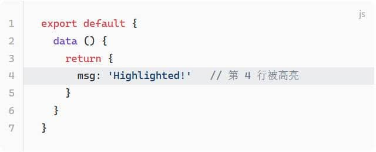
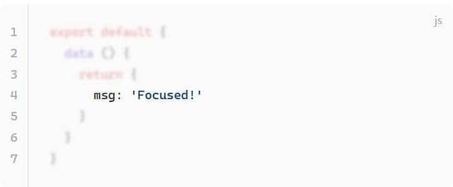
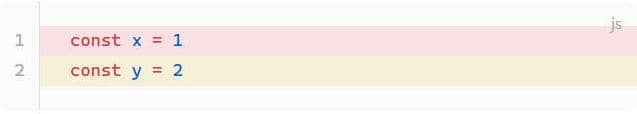
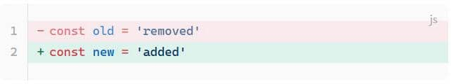
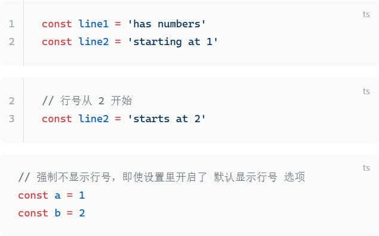
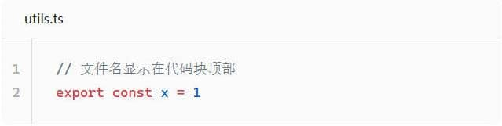
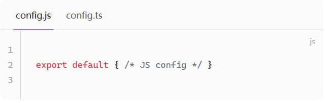

# Enhanced Code Blocks

<p align="center">
  <a href="./README.md">中文</a> ·
  <a href="./README.en.md"><b>English</b></a>
</p>

[](https://github.com/ltcooooooo/obsidian-enhanced-code-blocks/releases)

Bring VitePress-style Markdown code-block syntax to Obsidian — line highlighting, focus, diff, error / warning markers, line numbers, filename titles, and code groups. Every one of these VitePress-flavoured extensions works natively inside your notes.

## Features

| Feature | Effect |
|---------|--------|
| **Line highlighting** | Highlight specified lines |
| **Focus** | Focus specific lines, blur the rest |
| **Diff markers** | Added / removed line styles |
| **Error / Warning** | Error- or warning-coloured line markers |
| **Line numbers** | Show line numbers, optional start value |
| **Filename title** | Display filename title above code blocks |
| **Code groups** | Tabbed multi-language display |
## Installation

1. In Obsidian, open **Settings → Community plugins → Community plugin marketplace**
2. Search for "Enhanced Code Blocks"
3. Click Install, then enable the plugin

Or install manually:
1. Download the latest `main.js` and `manifest.json` from [Releases](https://github.com/ltcooooooo/obsidian-enhanced-code-blocks/releases)
2. Drop them into `<vault>/.obsidian/plugins/enhanced-code-blocks/`
3. Restart Obsidian and enable the plugin

## Usage

### Line highlighting

````markdown
```js{4}
export default {
  data () {
    return {
      msg: 'Highlighted!'   // line 4 is highlighted
    }
  }
}
```

Multiple lines are supported: `{1,3-5,7}` highlights line 1, lines 3–5, and line 7.
````


### Focus

````markdown
```js
export default {
  data () {
    return {
      msg: 'Focused!' // [!code focus]
    }
  }
}
```

Specify focus breadth: // [!code focus:2]
````


### Error / warning markers

````markdown
```js
const x = 1 // [!code error]
const y = 2 // [!code warning]
```
````



### Diff markers

````markdown
```js
const old = 'removed' // [!code --]
const new = 'added'     // [!code ++]
```
````



### Line numbers

````markdown
```ts :line-numbers
const line1 = 'has numbers'
const line2 = 'starting at 1'
```

```ts :line-numbers=2
// line numbers start at 2
const line1 = 'has numbers'
const line2 = 'starts at 2'
```

```ts :no-line-numbers
// line numbers are forced off, even when the plugin's
// "Default show line numbers" setting is on
const a = 1
const b = 2
```
````



### Filename title

````markdown
```ts [utils.ts]
// the filename is shown above the code block
export const x = 1
```
````



### Code group

````markdown
::: code-group
```js [config.js]
export default { /* JS config */ }
```

```ts [config.ts]
export default { /* TS config */ }
```
:::
````




## Settings

- **默认显示行号**: when on, every code block shows line numbers by default, unless `:no-line-numbers` is explicitly added.
